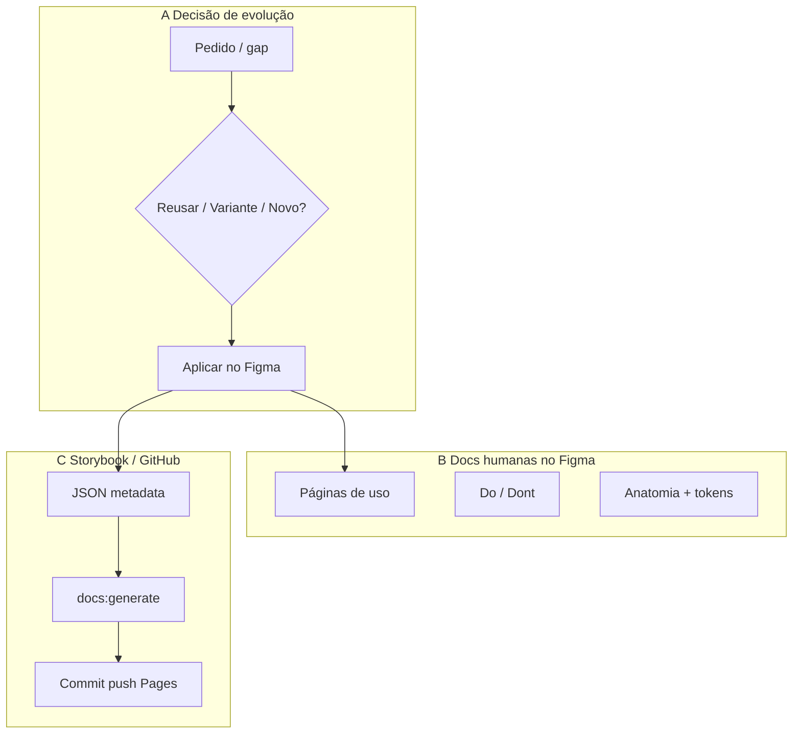

# Backlog DS 2.0 — Próximas etapas (humano)

**Atualizado:** 2026-08-17  
**Arquivo:** [[DS] 2.0 - S2](https://www.figma.com/design/mHm12Zu9tgNmaSYnooihE5/-DS--2.0---S2)  
**Storybook:** https://dalissonloovi.github.io/ds-2.0-s2/  
**Seed:** `design-system-tokens.storybook.updated.v2.json` (~124 componentes · 23 vars `product-theme`)  
**Revision recente:** `2026-08-17-painel-promo-tokens-seed`

**Estado:** fundação + temas core + Docs humanas + fila Painel Home **fechados**.  
**Modo atual:** melhoria contínua (gap de produto → decisão → Figma → seed → Pages).

---

## Visão — 3 frentes em paralelo



| Frente | Para quem | Objetivo |
|---|---|---|
| **A — Fluxo de melhoria** | Designers / DS | Decidir reusar, variante ou componente novo sem inflar o DS |
| **B — Documentação visual Figma** | Humanos (produto + design) | Usar o DS sem depender só de AI-Ready |
| **C — Storybook / GitHub** | Time + agentes | Catálogo publicado, changelog, sync com Figma |

---

## Frente A — Fluxo de melhoria do DS (decisão)

Usar **sempre** que surgir pedido de tela/produto ou gap.

### Árvore de decisão

1. **Já existe componente que resolve o caso?**  
   → **Reusar** (instância + props). Preferir composition a fork.
2. **É o mesmo papel, só muda look/estado/densidade/layout?**  
   → **Variante** (`variant` / `size` / `appearance` / `emphasis` / `layout`…) **ou** token `product-theme` se for diferença **por produto**.  
   Não criar segundo master.
3. **É papel novo (anatomia/comportamento diferente) e não cabe em props?**  
   → **Componente novo** (foundation) **ou** padrão de produto (`*Card`, tile, etc.) com nome claro.
4. **É só layout de tela?**  
   → **Não** vira componente DS; documentar como composição de tela.

### Checklist antes de criar variante / novo

- [ ] Nome kebab-case; subcomponente → sufixo `Item` (não `Block`)
- [ ] Tokens locais S2; sem hex solto relevante
- [ ] Descrição `AI-READY COMPONENT:` (EN)
- [ ] Props TEXT/BOOLEAN/INSTANCE_SWAP claros
- [ ] Feedback vocab: `info|system|success|warning|danger`
- [ ] Decisão registrada: reuso / variante / novo / composição

### Quando pedir ajuda ao orientador

> Pedido: [descrição do gap]  
> Opções que considerei: reusar X / variante em Y / novo Z  
> Links Figma: […]  
> Pergunta: qual caminho e por quê?

Página Figma: [Como evoluir o DS](https://www.figma.com/design/mHm12Zu9tgNmaSYnooihE5/-DS--2.0---S2?node-id=4807-72)

---

## Frente B — Documentação visual no Figma (humano)

Objetivo: páginas **para pessoas** (não só metadata AI).

### Por componente (mínimo)

| Bloco | Conteúdo |
|---|---|
| **Overview** | Quando usar / quando não usar |
| **Anatomy** | Camadas nomeadas + slots |
| **Variants** | Matrix visual kebab-case |
| **Content** | Props de texto/ícone com exemplos reais |
| **Tokens** | Binds principais (e `product-theme` se houver) |
| **Do / Don’t** | 2–4 exemplos |
| **A11y** | Nome acessível, foco, estados |

### Por família / produto

- Página **“Como evoluir o DS”** — ✅ (`node-id=4807-72`)
- ~~Docs humanas W0–W6~~ ✅ — [`DS-HUMAN-DOCS-REGISTRY.md`](./DS-HUMAN-DOCS-REGISTRY.md)
- ~~Auditoria W0–W6 + orphans W4~~ ✅ (2026-08-17)
- **Próximo (opcional):** página **App-cliente / Painel** com composições oficiais (só instâncias)
- Página **Temas** (quando necessário): trocar mode, não fork

### Ondas Docs humanas

| Onda | Status | Qtd |
|---|---|---|
| W0 Core | ✅ | 7 (+ governança) |
| W1 Formulários | ✅ | 15 |
| W2 Feedback | ✅ | 8 |
| W3 Nav/headers | ✅ | 14 |
| W4 Dados | ✅ | 11 |
| W5 Cards app | ✅ | 11 |
| W6 Complexos | ✅ | 9 |

`*Item` / `*Block`: sem página própria (só Anatomy do pai).

---

## Frente C — Storybook / GitHub

### Fluxo canônico (já em uso)

```text
Figma (ajuste)
 → design-system-tokens.storybook.updated.v2.json
 → cd storybook && npm run docs:generate
 → commit + push main
 → GitHub Pages
```

### Melhorias do catálogo

| Prioridade | Item | Notas |
|---|---|---|
| P0 | Manter sync por fatia | JSON + MDX + push após cada fechamento |
| P1 | Foundations no Storybook | Global rules, feedback, product-theme (já parcial) |
| P1 | Introduction / Changelog legíveis | Revisar copy humana (não só seed técnico) |
| P2 | Chromatic | Só se o time pedir review visual |
| P2 | React + CSF3 | Por componente; Autodocs substitui seed daquele item |
| P3 | Code Connect | Depois do React estabilizar |

### Definition of Done (fatia)

- [ ] Figma aplicado  
- [ ] JSON (`description`, props, rules, changelog, recentUpdates)  
- [ ] `npm run docs:generate`  
- [ ] Commit/push `main`  
- [ ] (Ideal) bloco visual no Figma atualizado na Frente B

---

## Status — o que já fechou vs o que falta

| Item | Status |
|---|---|
| Fundação + catálogo seed (~124) | 🟢 Avançado |
| `product-theme` core (23 vars) | 🟢 Feito — só sob demanda |
| Fluxo decisão Reusar/Variante/Novo | 🟢 Página Figma publicada |
| Docs visuais Figma (humanas) W0–W6 | 🟢 Completo + auditadas |
| Orphans W4 (DividerHorizontal / PaginationItem) | 🟢 Removidos após rewire |
| Painel Home audit queue | 🟢 Validada — [`ds-painel-audit/`](./ds-painel-audit/00-INDICE-AUDITORIA.md); promo tokens no seed |
| Limpeza untracked legado | 🟢 Feita (scripts/patches/JSON legado); audit versionado |
| Storybook Pages sync | 🟢 Operacional |
| Página composições App-cliente / Painel | ⬜ Opcional |
| React `@ds/react` + CSF3 Autodocs | 🟢 Fundação + W0–**W5 Cards & app-cliente** polish (2026-08-17) |
| Code Connect (W0) | 🟢 `*.figma.tsx` no piloto |
| Chromatic / npm público | ⬜ Depois (pedido explícito) |

---

## Próximos passos (ordem recomendada)

1. ~~Publicar “Como evoluir o DS”~~ ✅  
2. ~~Docs humanas W0–W6~~ ✅  
3. ~~Auditar frames Docs humanas~~ ✅  
4. ~~Limpar orphans W4~~ ✅  
5. ~~Validar fila Painel Home + sync promo tokens~~ ✅  
6. ~~Limpar untracked legado~~ ✅  
7. ~~React foundation + W0 Autodocs/Code Connect~~ ✅ — ver [`REACT-CONTRIBUTING.md`](./REACT-CONTRIBUTING.md)  
8. **Próximo:** polish scaffolds W6 (substituir stubs por implementação DoD completa, onda a onda)  
   - ~~W1 Formulários~~ ✅ React DoD (2026-08-17)
   - ~~W2 Feedback~~ ✅ React DoD (2026-08-17)
   - ~~W3 Nav/headers~~ ✅ React DoD (2026-08-17)
   - ~~W4 Dados & display~~ ✅ React DoD (2026-08-17)
   - ~~W5 Cards & app-cliente~~ ✅ React DoD (2026-08-17)
   - **Próximo:** W6 Complexos (audit → report → wait `aplicar`)
9. **Opcional:** página Figma de composições App-cliente / Painel  
10. **Opcional:** polish copy Introduction / Changelog  
11. **Só quando o time pedir:** Chromatic / publish npm / product-theme React provider

---

## Papel do agente

- Orientar decisão (reusar / variante / novo)  
- Auditar / mapear tokens quando pedido  
- Sync docs JSON → Storybook → commit/push quando você pedir  
- **Não** aplicar Figma sem `aplicar` explícito
