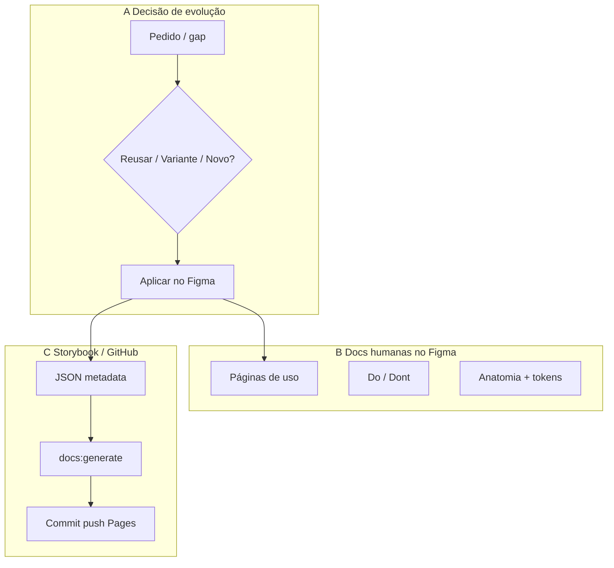

# Backlog DS 2.0 — Próximas etapas (humano)

**Atualizado:** 2026-11-23  
**Arquivo:** [[DS] 2.0 - S2](https://www.figma.com/design/mHm12Zu9tgNmaSYnooihE5/-DS--2.0---S2)  
**Storybook:** https://dalissonloovi.github.io/ds-2.0-s2/  
**Seed:** `design-system-tokens.storybook.updated.v2.json` (130 componentes · 127 com React · 23 vars `product-theme`)  
**Revision recente:** `2026-11-23-review-decisions`

**Estado:** fundação + temas core + Docs humanas + fila Painel Home + React W0–W7 **fechados**.  
**Modo atual:** melhoria contínua (gap de produto → decisão → Figma → seed → Pages).  
**Últimos applies:** 2026-09-21 Link (size, tipografia, tokens, paridade React) · 2026-11-23 saída Flutter, split de cores de feedback + `emphasis`, design fixes (Button `appearance=inverse`, Alert `showClose`, Modal `showFooter`, RadioButton disabled).

---

## Visão — 3 frentes em paralelo


```mermaid
flowchart TB
  subgraph A[A Decisão de evolução]
    D1[Pedido / gap]
    D2{Reusar / Variante / Novo?}
    D3[Aplicar no Figma]
    D1 --> D2 --> D3
  end
  subgraph B[B Docs humanas no Figma]
    F1[Páginas de uso]
    F2[Do / Dont]
    F3[Anatomia + tokens]
  end
  subgraph C[C Storybook / GitHub]
    S1[JSON metadata]
    S2[docs:generate]
    S3[Commit push Pages]
  end
  D3 --> F1
  D3 --> S1
  S1 --> S2 --> S3
```

| Frente | Para quem | Objetivo |
|---|---|---|
| **A — Fluxo de melhoria** | Designers / DS | Decidir reusar, variante ou componente novo sem inflar o DS |
| **B — Documentação visual Figma** | Humanos (produto + design) | Usar o DS sem depender só de AI-Ready |
| **C — Storybook / GitHub** | Time + agentes | Catálogo publicado, changelog, sync com Figma |

---

## Frente A — Fluxo de melhoria do DS (decisão)

Usar **sempre** que surgir pedido de tela/produto ou gap.

### Árvore de decisão

1. **Já existe componente que resolve o caso?**  
   → **Reusar** (instância + props). Preferir composition a fork.
2. **É o mesmo papel, só muda look/estado/densidade/layout?**  
   → **Variante** (`variant` / `size` / `appearance` / `emphasis` / `layout`…) **ou** token `product-theme` se for diferença **por produto**.  
   Não criar segundo master.
3. **É papel novo (anatomia/comportamento diferente) e não cabe em props?**  
   → **Componente novo** (foundation) **ou** padrão de produto (`*Card`, tile, etc.) com nome claro.
4. **É só layout de tela?**  
   → **Não** vira componente DS; documentar como composição de tela.

### Checklist antes de criar variante / novo

- [ ] Nome kebab-case; subcomponente → sufixo `Item` (não `Block`)
- [ ] Tokens locais S2; sem hex solto relevante
- [ ] Descrição `AI-READY COMPONENT:` (EN)
- [ ] Props TEXT/BOOLEAN/INSTANCE_SWAP claros
- [ ] Feedback vocab: `info|system|success|warning|danger`
- [ ] Decisão registrada: reuso / variante / novo / composição

### Quando pedir ajuda ao orientador

> Pedido: [descrição do gap]  
> Opções que considerei: reusar X / variante em Y / novo Z  
> Links Figma: […]  
> Pergunta: qual caminho e por quê?

Página Figma: [Como evoluir o DS](https://www.figma.com/design/mHm12Zu9tgNmaSYnooihE5/-DS--2.0---S2?node-id=4807-72)

---

## Frente B — Documentação visual no Figma (humano)

Objetivo: páginas **para pessoas** (não só metadata AI).

### Por componente (mínimo)

| Bloco | Conteúdo |
|---|---|
| **Overview** | Quando usar / quando não usar |
| **Anatomy** | Camadas nomeadas + slots |
| **Variants** | Matrix visual kebab-case |
| **Content** | Props de texto/ícone com exemplos reais |
| **Tokens** | Binds principais (e `product-theme` se houver) |
| **Do / Don’t** | 2–4 exemplos |
| **A11y** | Nome acessível, foco, estados |

### Por família / produto

- Página **“Como evoluir o DS”** — ✅ (`node-id=4807-72`)
- ~~Docs humanas W0–W6~~ ✅ — [`DS-HUMAN-DOCS-REGISTRY.md`](./DS-HUMAN-DOCS-REGISTRY.md)
- ~~Auditoria W0–W6 + orphans W4~~ ✅ (2026-08-17)
- **Próximo (opcional):** página **App-cliente / Painel** com composições oficiais (só instâncias)
- Página **Temas** (quando necessário): trocar mode, não fork

### Ondas Docs humanas

| Onda | Status | Qtd |
|---|---|---|
| W0 Core | ✅ | 7 (+ governança) |
| W1 Formulários | ✅ | 15 |
| W2 Feedback | ✅ | 8 |
| W3 Nav/headers | ✅ | 14 |
| W4 Dados | ✅ | 11 |
| W5 Cards app | ✅ | 11 |
| W6 Complexos | ✅ | 9 |

`*Item` / `*Block`: sem página própria (só Anatomy do pai).

---

## Frente C — Storybook / GitHub

### Fluxo canônico (já em uso)

```text
Figma (ajuste)
 → design-system-tokens.storybook.updated.v2.json
 → cd storybook && npm run docs:generate
 → commit + push main
 → GitHub Pages
```

### Melhorias do catálogo

| Prioridade | Item | Notas |
|---|---|---|
| P0 | Manter sync por fatia | JSON + MDX + push após cada fechamento |
| P1 | Foundations no Storybook | Global rules, feedback, product-theme (já parcial) |
| P1 | Introduction / Changelog legíveis | ✅ Copy humana (2026-08-17); hoje Autodocs 127/130; changelog truncado |
| P2 | Chromatic | Só se o time pedir review visual |
| P2 | React + CSF3 | Por componente; Autodocs substitui seed daquele item |
| P3 | Code Connect | Depois do React estabilizar |

### Definition of Done (fatia)

- [ ] Figma aplicado  
- [ ] JSON (`description`, props, rules, changelog, recentUpdates)  
- [ ] `npm run docs:generate`  
- [ ] Commit/push `main`  
- [ ] (Ideal) bloco visual no Figma atualizado na Frente B

---

## Status — o que já fechou vs o que falta

| Item | Status |
|---|---|
| Fundação + catálogo seed (130) | 🟢 Avançado |
| `product-theme` core (23 vars) | 🟢 Feito no Figma/seed |
| `product-theme` em código (tokens por mode + React) | ⬜ Não feito — React emite só o visual Escritório Virtual |
| Fluxo decisão Reusar/Variante/Novo | 🟢 Página Figma publicada |
| Docs visuais Figma (humanas) W0–W6 | 🟢 Completo + auditadas |
| Orphans W4 (DividerHorizontal / PaginationItem) | 🟢 Removidos após rewire |
| Painel Home audit queue | 🟢 Validada — [`ds-painel-audit/`](./ds-painel-audit/00-INDICE-AUDITORIA.md); promo tokens no seed |
| Limpeza untracked legado | 🟢 Feita (scripts/patches/JSON legado); audit versionado |
| Storybook Pages sync | 🟢 Operacional |
| Página composições App-cliente / Painel | ⬜ Opcional |
| React `@ds/react` + CSF3 Autodocs | 🟢 W0–**W7** polish (2026-08-17); hoje 127/130 (sem React: CommentItem, BrandLogo, PaymentMethodMark) |
| Code Connect (W0–W7) | 🟢 `*.figma.tsx` no piloto + ondas |
| Introduction / Changelog copy | 🟢 Polish 2026-08-17 — gerador, não MDX à mão |
| Tipografia Poppins no React/Storybook | 🟢 P1 2026-08-18 — `--font-family-base` + woff2; escala px→token ainda P2 |
| Chromatic / npm público | ⬜ Depois (pedido explícito) |

---

## Próximos passos (ordem recomendada)

1. ~~Publicar “Como evoluir o DS”~~ ✅  
2. ~~Docs humanas W0–W6~~ ✅  
3. ~~Auditar frames Docs humanas~~ ✅  
4. ~~Limpar orphans W4~~ ✅  
5. ~~Validar fila Painel Home + sync promo tokens~~ ✅  
6. ~~Limpar untracked legado~~ ✅  
7. ~~React foundation + W0 Autodocs/Code Connect~~ ✅ — ver [`REACT-CONTRIBUTING.md`](./REACT-CONTRIBUTING.md)  
8. ~~React leftovers draft~~ ✅ W7 (ChipGroup, ImageItem/PhotoTextItem, PaginationSelect*, TableSkeleton, ModalHeader/ModalCheckItem)  
   - ~~W1 Formulários~~ ✅ React DoD (2026-08-17)
   - ~~W2 Feedback~~ ✅ React DoD (2026-08-17)
   - ~~W3 Nav/headers~~ ✅ React DoD (2026-08-17)
   - ~~W4 Dados & display~~ ✅ React DoD (2026-08-17)
   - ~~W5 Cards & app-cliente~~ ✅ React DoD (2026-08-17)
   - ~~W6 Complexos~~ ✅ React DoD (2026-08-17)
   - ~~W7 Internals & leftovers~~ ✅ React DoD (2026-08-17)
9. **Opcional:** página Figma de composições App-cliente / Painel  
10. ~~Polish copy Introduction / Changelog~~ ✅ (2026-08-17) — gerador; Autodocs 123/124; CommentItem seed  
11. **Só quando o time pedir:** Chromatic / publish npm
12. **Gaps para o Site Loovi** (cada um passa por auditar → reportar → `aplicar`):
    - `product-theme` em código: gerador de tokens emite modes (`escritorio-virtual` | `site-loovi` | `app-cliente`) + React consome `--component-*` + toolbar de produto no Storybook
    - Breakpoints do seed (`xxs 0 · xs 360 · sm 700 · md 834 · lg 1152 · xl 1280`) em `tokens.css` + grid / container / colunas
    - Biblioteca de ícones do `site-loovi` (contrato `*-outline` / `*-filled`)
    - Escala tipográfica de marketing (> 40px) e tipografia responsiva
    - Componentes de site (header de marketing, footer, hero, cards de plano, depoimento, cotação): decidir reusar / variante / novo / composição
    - Forma de consumo dos pacotes (git, GitHub Packages ou monorepo)
13. React para CommentItem, BrandLogo e PaymentMethodMark (quando pedido)
14. **Saída Flutter (App Cliente)** — onda 1 entregue em 2026-11-23 (`loovi_tokens` + `loovi_ds`, 21 componentes; ver [`FLUTTER-CONTRIBUTING.md`](./FLUTTER-CONTRIBUTING.md) e [`FLUTTER-INVENTORY.md`](./FLUTTER-INVENTORY.md)). Próxima onda só quando pedida.
    - **Onda 2 entregue (2026-11-24, 36 componentes no total):** QuickAccessTile, VehicleSummaryCard, OfferProductCard, ReferralDiscountCard, Avatar, Badge, LoadingSpinner, DividerHorizontal, Toast, Banner, TabItem, TabsPrimary/Secondary/Segmented, Accordion. Auditoria aplicada (revision `2026-11-24-wave2-audit-fixes`): Badge nodeId → `3669:8175`; variáveis remotas legadas no TabsPrimary e Accordion trocadas; gaps/raio ligados a tokens.
    - **Widgetbook publicado (2026-11-24):** https://dalissonloovi.github.io/ds-2.0-s2/flutter/ (job `widgetbook` no workflow do Pages).
    - **Onda 3 entregue (2026-11-24, 60 componentes no total):** formulários e fluxos — InputSelect, InputDatePicker, DatePickerSelect(Item), InputNumber, SelectCountry, InputNumberTrailingPaymentMark, Autocomplete, SearchBar, SearchViewFullscreen, VerificationCodeInput(Item), RadioButtonCard, ChipGroup, ModalCheckItem, BottomSheetCheckItem, ProgressBar, StepProgressIndicator/Segment, StepperPrimary, VerticalStepper(Item), Tooltip, TooltipRich. Ícones novos: calendar-outline, circle-x-filled, arrow-narrow-left-outline (45 no pacote). Achados de Figma/seed da auditoria aguardam decisão. Sem arte no pacote: bandeiras (SelectCountry) — o app passa a arte por parâmetro.
    - **Onda 4 entregue (2026-11-24, 86 componentes no total):** cards (CardOutlined/Elevated/FilledItem, CardHorizontal, CardStacked, DashboardCardPrimary/Secondary, VehicleConfirmCard), conteúdo (Carousel, CarouselPaginationItem, FeatureSteps(Item), AvatarGroup, TextHeader, Overlay), partes de lista (ListActionDropdown(Item), ListItemLeadingMonogram, ListItemStateLayer, ListItemImage/VideoThumbnail, ListItemLeading/TrailingIllustration, ListItemLeadingPaymentMark) e marca/pagamento (BrandLogo, PaymentMethodMark com 25 bandeiras). Ícones: 57 no pacote. Achados de Figma/seed aguardam decisão.

### Achados da auditoria Flutter (2026-11-23)

**Aplicado em 2026-11-23** (revision `2026-11-23-flutter-audit-seed-sync`):
- Seed ← Figma: `interactive/selected` #D0D9E8, `color/overlay/overlay` 48%, `feedback/info` (#54DEF8) adicionado, `color/elevation/focus` adicionado (`pressed` deprecated).
- `tokens.component` completo (23/23); `app-header/leading-action/background` [escritorio-virtual] → #FCFCFE.
- nodeIds: Switch → `3653:4741`, NavigationBarItem → `3653:15180` (seed + Code Connect).
- Impacto: CSS/React (Escritório Virtual) — selected fica azulado e o overlay mais claro; Flutter regenerado; Storybook regenerado.

**Aplicado em 2026-11-23 — cores de feedback e emphasis** (revision `2026-11-23-feedback-split-emphasis`)

| Uso | Token | Valor | Contraste (surface/0) |
| --- | --- | --- | --- |
| Ícone/indicador **com rótulo** | `feedback/{success · danger · warning · info}` | #2DBE5E · #F54444 · #FFB74C · #54DEF8 (Figma) | 2,4 · 3,5 · 1,7 · 1,6 |
| **Texto** de status e ícone **sozinho** | `text/{success · danger · warning · info}` (novos) | #00723E · #D81C1A · #7A6400 · #04778A | 5,9 · 5,0 · 5,6 · 5,1 |
| Fundo forte / suave | `background-feedback-{primary · secondary}/{status}` | secondary novos: info teal-2 #E1FBFF, system azure-2 #D9E0FF | conteúdo text/primary ≥ 12:1 |

- Primitivas novas: `amber-700` #7A6400, `teal-700` #04778A.
- Figma: 405 textos religados de `feedback/*` → `text/*` (Button, família Input, DatePicker, FileUploaderItem, Slider, VerificationCodeInput).
- `emphasis = primary | secondary`: ChipTag (renomeado de strong | soft, +16 variantes), ChipClickable (+84), Banner (+4). Alert fora (status só muda o ícone).
- Regra no seed: `meta.governance.feedbackColorRule`.
- ~~Banner `status=info` primary ligado a `…/system`~~ → corrigido para `background-feedback-primary/info` (2026-11-23).

**Ícones App Cliente** — auditoria em [`ds-icons-audit/2026-11-23-app-cliente-aliases.md`](./ds-icons-audit/2026-11-23-app-cliente-aliases.md). Limpeza aplicada em 2026-11-23: 6 duplicados removidos, 34 criações do time preservadas, 394 `*-filled` com preenchimento real, 3.482 aliases anotados (mesmo desenho). **Pendente (design):** 206 `*-filled` de traço aberto para desenhar à mão e mapeamentos estranhos listados na auditoria. Seta×chevron, traços e `car-side-filled` **aplicados em 2026-11-23**; `" tire"` duplica `tire-outline` (design decide). Publicar a biblioteca no Figma para propagar. Faltam ainda `player-play-outline` e `player-record-filled` no pacote Flutter.

**Figma — componentes**
- Resolvidos em 2026-11-23 (revision `2026-11-23-design-fixes`, conferido no Figma): RadioButton disabled on × off (ring `border/width/050` + `text/placeholder`), AppHeader specific (trailing lado a lado; 3143:8856 em SPACE_BETWEEN), ModalHeader close ligado a `component/modal-header/close-action/*`, Alert inverse brand ligado a `color/background-surface/brand`.
- ~~ChipTag md ícone 32 / ChipClickable sm avatar 22 sem variável~~ → ligados a `spacing/250|300|400` (avatar sm do ChipClickable 22 → 20; chip sm 30 → 28) em 2026-11-23. Frames sem variável — ver `meta.governance.unboundValues` no seed.

**Decisões da revisão — aplicado em 2026-11-23** (revision `2026-11-23-review-decisions`)

| # | Decisão | O que mudou |
| --- | --- | --- |
| 1 | Chips: padrão suave | `emphasis=secondary` é o padrão no Figma (variante do topo à esquerda), React e Flutter; `primary` (forte) é opt-in. Escritório Virtual não muda. ChipTag tinha as 4 variantes secondary/success empilhadas sobre as primary — reposicionadas. |
| 2 | Contraste dos botões | `color/actions/primary` → sapphire #516CE7 (4,52:1); `color/actions/danger` → crimson-red #D81C1A (5,12:1); solid secondary com texto/ícone `text/primary` (9,1:1); solid success com rótulo `text/on-color`; hover/pressed/selected do success e secondary com camada de estado (antes cobriam a cor). Novo `color/background-surface/brand-strong` #516CE7 para fundo de marca com texto branco pequeno (chips brand, Alert inverse, AppHeader inverse no site-loovi e app-cliente). `background-surface/brand` (#5A78FF) continua para áreas grandes. |
| 3 | Banner info | primary ligado a `background-feedback-primary/info`. |
| 4 | Remover do ChipClickable | visual 16 × 16; área de toque ≥ 24 × 24 no código, sem mudar o tamanho do chip. |
| 5 | NavigationBarItem | rótulo selecionado `text/primary` (ícone segue `actions/primary`); número do badge `text/primary` (6,7:1). |
| 6 | Seed × Figma | Button: props como no Figma (sem `trailingIcon` swap; `loading` é estado; `disabled` é VARIANT). Alert React alinhado ao Figma (padding, borda da ação, ícone no inverse). |
| P3 | Ajustes | AppHeader small-centered com título no centro (390 de largura, lados equilibrados); 115 ligações a variáveis remotas legadas (`Color/Content/*`, `Color/Interactive/*`, `Schemes/*`) trocadas por tokens S2 locais; `variableCount` 301; `elevation/pressed` segue deprecated até o próximo major; RadioButton marcado = anel sem ponto central (confirmado no Figma); textos padrão do Modal em português; stories antigas de ChipTag renomeadas; helper `plusDarker` único no Flutter; `CLAUDE.md` sem menção a handoff local. |

- Limitação da Plugin API registrada em `meta.governance.stateLayerBlend`: blend e opacidade de pintura se perdem em pinturas ligadas a variável — usar nó `stateOverlay` com blend no nó.

**Oficializados em 2026-11-23** (antes eram exceções do Flutter): Alert `showClose`, Modal `showFooter`, Button `appearance=inverse` — Figma + seed + React + Flutter.

**Propostas de componente**
- LoadingSpinner Flutter (hoje interno ao Button).

---

## Papel do agente

- Orientar decisão (reusar / variante / novo)  
- Auditar / mapear tokens quando pedido  
- Sync docs JSON → Storybook → commit/push quando você pedir  
- **Não** aplicar Figma sem `aplicar` explícito
